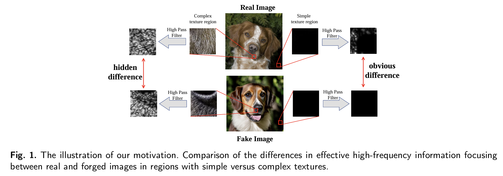
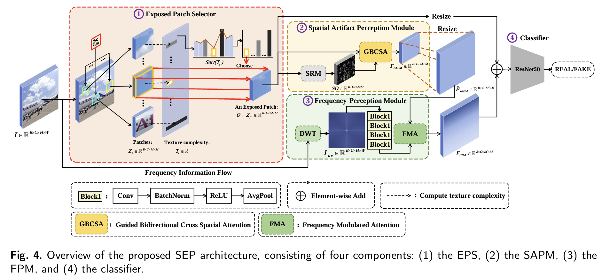

# All-Patches-Are-Not-Equal-Focusing-on-a-Single-Exposed-Patch-for-AI-Generated-Image-Detection-

  

# Abstract: 
With the rapid advancement of generative models, AI-generated images have become highly photorealistic, rendering authenticity detection challenging. Existing detection methods handle all image patches uniformly, overlooking that low-texture regions exhibit more pronounced artifact signals than complex-textured areas, where high-frequency information of complex texture inherent to the complex content interferes with artifact detection. To address this limitation, we proposed a single exposed patch  (SEP) detection framework that strategically identifies and mines one patch per image to capture distinctive cues. Specifically, we developed an exposed patch selector (EPS) that precisely identifies the most discriminative patch region by analyzing pixel-level texture distributions, ensuring that the selected patch is minimally affected by high-frequency noise in the image. To better exploit artifact cues from the selected patch and mitigate the interference from irrelevant high-frequency information, we proposed the spatial artifact perception module (SAPM). The module preserves low-level features and spatial structure and introduces a guided bidirectional cross-spatial attention (GBCSA) mechanism guided by high-frequency cues, reducing reliance on high-frequency inputs and enhancing sensitivity to minor artifacts in flat regions. Building on this, we designed a frequency perception module (FPM) to detect the periodic artifact patterns generated in the frequency domain by generative models (e.g., GANs ), thereby enhancing the ability of the model to detect artifacts across different generative mechanisms. Experimental results demonstrate the superior cross-generator generalization capabilities of SEP. We conducted comparisons on two major public datasets (GenImage and AIGCBenchmark). The million-scale GenImage dataset comprises eight  different generative models, and the AIGCBenchmark encompasses a broader range of 16 diverse generative models. SEP achieved an accuracy of 97.05\% on GenImage, substantially surpassing recent state-of-the-art methods from 2025 (approximately 91\%) and outperforming 20 baselines by an average of 5.16\%. Furthermore, on the AIGCBenchmark, SEP yielded an average performance gain of 6.81\%.

  

## GenImage Cross-generator Generalization (ACC%)

Models are trained on images generated by Stable Diffusion v1.4 and tested on unseen generators. “Mean” denotes the average accuracy across all test generators.

| Method | Ref | Midjourney | SDv1.4 | SDv1.5 | ADM | GLIDE | Wukong | VQDM | BigGAN | Mean |
|---|---:|---:|---:|---:|---:|---:|---:|---:|---:|---:|
| F3Net | ECCV2020 | 50.10 | <u>99.90</u> | **99.90** | 49.90 | 50.00 | **99.90** | 49.90 | 49.90 | 68.65 |
| GramNet | CVPR2020 | 54.20 | 99.20 | 99.10 | 50.30 | 54.60 | 98.90 | 50.80 | 51.70 | 69.85 |
| DIRE | ICCV2023 | 60.20 | <u>99.90</u> | 99.80 | 50.90 | 55.00 | 99.20 | 50.10 | 50.20 | 70.66 |
| UnivFD | CVPR2023 | 73.20 | 84.20 | 84.00 | 55.20 | 76.90 | 75.60 | 56.90 | 80.30 | 73.29 |
| GenDet | Arxiv2023 | 89.60 | 96.10 | 96.10 | 58.00 | 78.40 | 92.80 | 66.50 | 75.00 | 81.56 |
| PatchCraft | Arxiv2024 | 79.00 | 89.50 | 89.30 | 77.30 | 78.40 | 89.30 | 83.70 | 72.40 | 82.36 |
| NPR | CVPR2024 | 81.00 | 98.20 | 97.90 | 76.90 | 89.80 | 96.90 | 84.10 | 84.20 | 88.63 |
| FreqNet | AAAI2024 | 89.60 | 98.80 | 98.60 | 66.80 | 86.50 | 97.30 | 75.80 | 81.40 | 86.85 |
| FatFormer | CVPR2024 | <u>92.70</u> | **100.00** | **99.90** | 75.90 | 88.00 | **99.90** | <u>98.80</u> | 55.80 | 88.88 |
| DRCT | ICML2024 | 91.50 | 95.00 | 94.40 | 79.40 | 89.10 | 94.60 | 90.00 | 81.60 | 89.45 |
| AIDE | ICLR2025 | 79.38 | 99.74 | 99.76 | 78.54 | 91.82 | 98.65 | 80.26 | 66.89 | 86.88 |
| C2CLIP | AAAI2025 | 88.20 | 90.90 | 97.90 | **96.40** | <u>99.00</u> | 98.80 | 96.50 | 98.70 | <u>95.80</u> |
| SAFE | KDD2025 | **95.30** | 99.40 | 99.30 | 82.10 | 96.30 | 98.20 | 96.30 | <u>97.80</u> | 95.59 |
| Effort | ICML2025 | 82.40 | 99.80 | 99.80 | 78.70 | 93.30 | 97.40 | 91.70 | 77.60 | 91.10 |
| F-ConV | NeurIPS2025 | 89.30 | 98.80 | 98.50 | 74.90 | 89.30 | 95.60 | 86.70 | 87.60 | 90.10 |
| **Ours** | / | **86.08** | **99.33** | **99.24** | <u>95.89</u> | **99.03** | **99.11** | **99.06** | **98.68** | **97.05** |

## TODO / Checklist

- [x] Release inference-only code (this repo currently provides **inference code only**).
- [x] Provide pretrained weights for quick evaluation/demo.

- [ ] Clean and release full training pipeline (configs, dataloader, augmentation, optimizer/scheduler).
